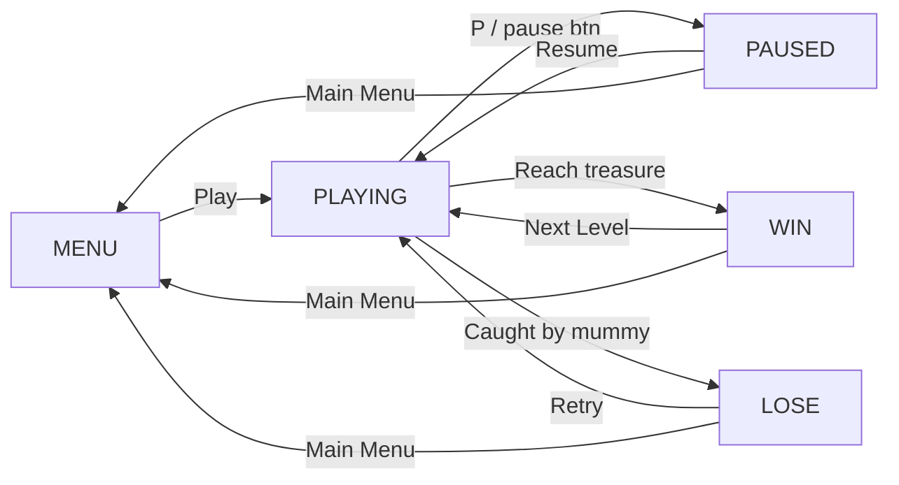

# Curse of the Pyramids — Rebuild Walkthrough

## How to Run

```powershell
cd d:\Projects\maze
python main.py
```

> [!IMPORTANT]
> Requires **Python 3.9+** and **pygame** (`pip install pygame`).

---

## Project Structure

```
d:\Projects\maze\
├── main.py                 ← Entry point — run this
├── assets\                 ← All PNG images (unchanged)
├── sounds\                 ← All MP3 files (unchanged)
└── src\
    ├── __init__.py
    ├── constants.py        ← All config values, sizes, colours, timing
    ├── pathfinding.py      ← Improved A* algorithm
    ├── asset_loader.py     ← Centralised image/sound loading
    ├── maze.py             ← Grid data + tile rendering (baked surface)
    ├── player.py           ← Player movement + LERP animation
    ├── enemy.py            ← Mummy AI + level-scaling speed
    ├── audio.py            ← Music + SFX manager
    ├── ui.py               ← Button, HUD, all screen overlays, fade
    └── game.py             ← State machine + main loop
```

---

## Gameplay

| Feature | Detail |
|---|---|
| Player start | Top-left `(col=1, row=1)` |
| Goal (treasure) | Bottom-right `(col=13, row=13)` |
| Enemy start | Centre `(col=7, row=7)` — gives player a head start |
| Win condition | Player reaches the treasure |
| Lose condition | Enemy occupies same cell as player |
| Levels | Win → next level with faster enemy (speed × 0.85 per level) |

---

## Controls

| Input | Action |
|---|---|
| Arrow keys / WASD | Move player |
| `P` or `Escape` | Pause / Resume |
| Pause button (top-right icon) | Pause |
| Mouse clicks | All menu & HUD buttons |

---

## Screen States



---

## Assets Used

| Asset | Where |
|---|---|
| `start menu.png` | Start screen background |
| `pause.png` | Pause overlay (centred, letterboxed) |
| `win.png` | Victory screen background |
| `LOSE.png` | Defeat screen background |
| `PauseButton.png` | HUD pause icon (top-right) |
| `wall.png` / `floor.png` | Maze tiles (scaled to 40×40 px) |
| `player up/down/left/right.png` | Directional player sprites |
| `mummy up/down/left/right.png` | Directional enemy sprites |
| `treasure.png` | Goal cell |
| `Main Sound TRack.mp3` | Looping background music |
| `win sound.mp3` | Played on victory |
| `losing sound.mp3` | Played on defeat |

---

## Key Architecture Decisions

- **Baked maze surface** — tiles are rendered once to a `Surface` at startup; `draw()` is a single `blit()` per frame instead of 225 individual blits.
- **LERP smooth movement** — both the player and mummy interpolate their pixel position toward their logical grid cell every frame, giving fluid animation at 60 FPS despite grid-step movement.
- **A* fix** — the original had an O(n) open-set membership check (`neighbor not in [i[1] for i in oheap]`). The new version uses a `set` for O(1) lookups.
- **Enemy re-plans eagerly** — path is recalculated when the timer fires *OR* when the path runs out, eliminating the "standing still" bug.
- **State machine is the single source of truth** — `Game.state` drives all rendering and event dispatch; no flags scattered across modules.
- **Graceful audio fallback** — if any sound file is missing or `pygame.mixer` fails, the game plays silently rather than crashing.
